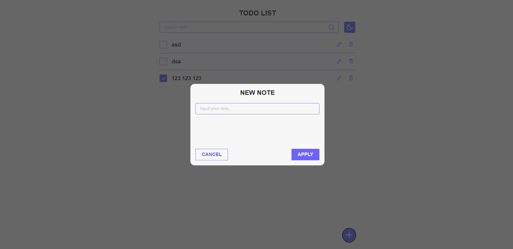
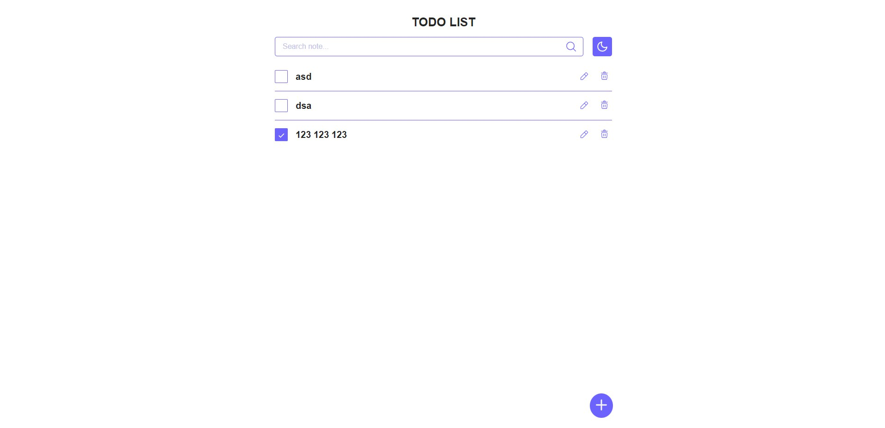
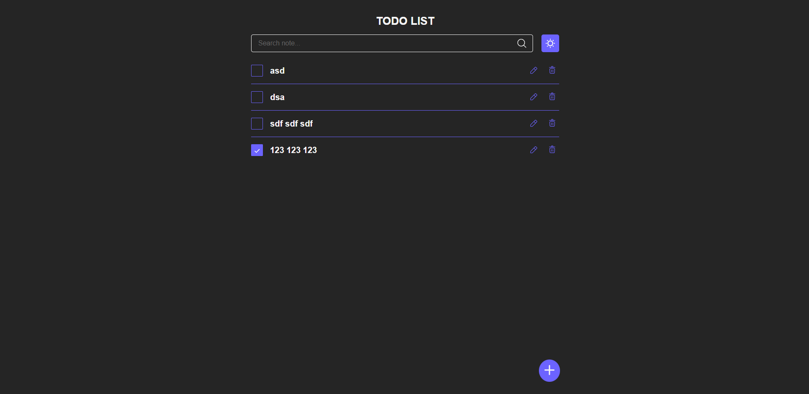

# ToDo List - React + TypeScript



## Описание

Это приложение для управления списком задач с расширенным функционалом:
- **Добавление задач**: Возможность добавлять новые задачи с указанием их названия.
- **Удаление задач**: Удаление задач из списка по клику на соответствующую кнопку.
- **Изменение статуса выполнения**: Отметка задач как выполненные или невыполненные.
- **Поиск по задачам**: Поле поиска для фильтрации задач по названию.
- **Переключение темы**: Возможность переключения между светлой и тёмной темой.
- **Сохранение данных в localStorage**: Список задач и текущая тема сохраняются в `localStorage`, что позволяет сохранять данные между сессиями.

Приложение разработано с использованием следующих технологий:
- **React** + **Vite**
- **TypeScript**
- **Styled Components**
- **Redux Toolkit**

## Демо

Приложение доступно по следующей ссылке:

[ToDo List - GitHub Pages](https://blinklay.github.io/todo-react-ts/)

## Скриншоты

### Светлая тема


### Тёмная тема


## Установка и запуск

Для локального запуска приложения выполните следующие шаги:

1. Клонируйте репозиторий:

    ```bash
    git clone https://github.com/blinklay/todo-react-ts.git
    ```

2. Перейдите в директорию проекта:

    ```bash
    cd todo-react-ts
    ```

3. Установите зависимости:

    ```bash
    npm install
    ```

4. Запустите приложение:

    ```bash
    npm run dev
    ```

После этого приложение будет доступно по адресу `http://localhost:3000`.

